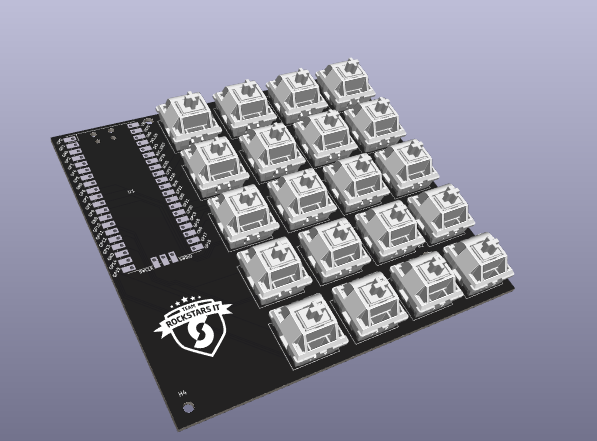

# RSMP

AKA "Rockstars Macropad". A [KMK](https://github.com/KMKfw/kmk_firmware) and Raspberry pi based 20 key macropad. The macropad is direct pin, meaning every button uses a dedication gpio pin, so no diodes are needed.

This was created for a workshop at [Team Rockstars IT](https://www.teamrockstars.nl/)

## BOM

  - Raspberry Pi Pico. Make sure you get the variant with gpio pins 16/17 in the bottom right
  - 20 Cherry MX compatible switches
  - 20 Cherry MX keycaps
  - Main PCB
  - Bottom plate PCB
  - 8x M2.5 screws
  - 4 Spacers
  - Those round bumper things you stick under something to make it non-slip

## Software

  - Dowload the [Circuitpython](https://circuitpython.org/) release for the pico board.
  - Plug in the pi pico while holding the "boot" button
  - Copy the circuitpython Uf2 to the root of the device
  - It should now reboot, and you should have a "CIRCUITPY" storage device
  - Remove the `code.py` file from the storage device
  - Copy all files from the `firmware` folder to the root of the drive
  - Replug the device

It should now behave as a keyboard.

### Firmware

This macropad uses KMK for it's firmware. KMK is a flexible circuitpython based project for mechanical keyboards that offers a lot of options. The basic firmware for the RSMP is simple, in that every button outputs a letter. To customize the behavior, you can modify `main.py`.

## Credits

  - [KMK](https://github.com/KMKfw/kmk_firmware) - Keyboard software
  - [ncarandini](https://github.com/ncarandini/KiCad-RP-Pico) - Kicad pi pico footprint and model
  - [foostan](https://github.com/foostan/kbd) - Keyboard switch footprints

